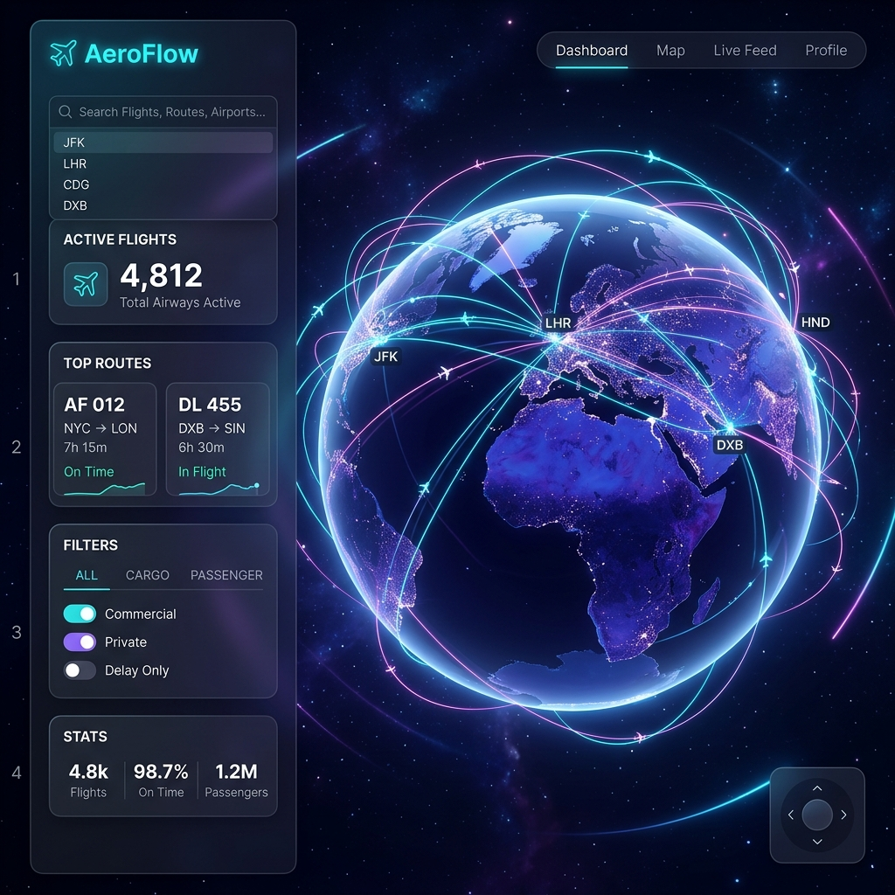

# AeroFlow - Global Flight Connections Map

An interactive, high-fidelity world map flight connections visualizer using **True-to-Earth projections** and United Nations recognized nation-state country borders. AeroFlow features a futuristic dark-theme interface with smooth glassmorphism dashboards, glowing great-circle geodesic paths, and dynamic flight flow animations.



## ✈️ Key Features

- **Dual True-to-Earth Projections**:
  - **3D Orthographic Globe**: A realistic, interactive 3D sphere. Drag to spin the planet, scroll to zoom, and watch flights arc gracefully over the earth.
  - **2D Equal Earth Projection**: A true-to-earth equal-area flat projection showing highly accurate relative sizes of all landmasses (eliminating Mercator distortion).
- **Interactive Autocomplete Filters**:
  - **Filter by Airline**: Search for airlines (e.g., Qantas, French Bee, Air France) to instantly highlight their active global flights and display tailored statistics, including headquarters, unique countries connected, total routes, and primary hubs.
  - **Filter by Location**: Search for airports or cities (e.g., Paris, Melbourne, Singapore) to view all direct inbound/outbound flights pulsing from the target hub, along with a tally of key operating carriers.
- **Premium Aesthetics & UX**:
  - Full-screen HTML5 `<canvas>` rendering engine delivering a fluid **60 FPS** performance.
  - Glowing geodesic flight arcs and animated flow particles representing live airplanes.
  - Interactive glassmorphic detail tooltips on airport mouse hover.
  - Auto-rotation idle timer that spins the globe when inactive.
  - Floating camera control widgets (zoom in, zoom out, reset view, auto-rotate lock).

---

## 🛠️ Tech Stack & Libraries

- **Frontend Structure**: HTML5 Canvas & Semantic Elements
- **Design System**: Vanilla CSS featuring Custom Properties, CSS Grid, Glassmorphic filters, and micro-animations
- **Mapping & Geometry**: [D3.js (v7)](https://d3js.org/) for projections, graticule lines, coordinate transforms, and geodesic interpolations
- **Data Engine**: Python-based pre-processing pipeline compiling raw datasets into highly compressed index-based structures (reducing bundle sizes by 85%)
- **Icons**: [Lucide Icons](https://lucide.dev/)

---

## 🚀 Running Locally

AeroFlow requires zero compile steps and runs entirely client-side. You can serve the project using any local HTTP server:

### Option A: Python HTTP Server (Built-in)
Run the following command in the project directory:
```bash
python3 -m http.server 8080
```
Then open your browser and navigate to **[http://localhost:8080](http://localhost:8080)**.

### Option B: Node.js (npx)
Alternatively, if you have Node.js installed, you can spin up a server using:
```bash
npx serve .
```

---

## 📊 Data Sources & Specifications

1. **Airports & Routes Database**: Sourced and compiled from the [OpenFlights Database](https://openflights.org/data.html). To maximize client-side performance, the dataset is optimized to index the top 1,800 busiest commercial airports, representing **52,000+ flight routes** in under 770KB.
2. **Sovereign Boundaries**: Geometries are sourced from [Natural Earth Data](https://www.naturalearthdata.com/) at 1:110m scale, customized to represent sovereign nation-state boundaries in compliance with United Nations cartographic guidelines.

---

## 📂 Project Structure

```
flight-map/
├── assets/
│   └── screenshot.png       # README visual demonstration
├── data/
│   ├── countries.geojson    # Simplified boundary geometries
│   └── data.json            # Compressed airports & routes bundle
├── scripts/
│   └── process_data.py      # Python ingestion script
├── app.js                   # Canvas rendering, drag/zoom & control logic
├── index.css                # Futuristic glassmorphic styling
├── index.html               # Semantic structural markup
└── README.md                # Project documentation
```
